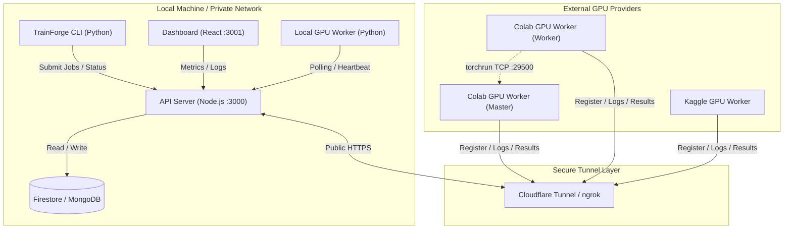
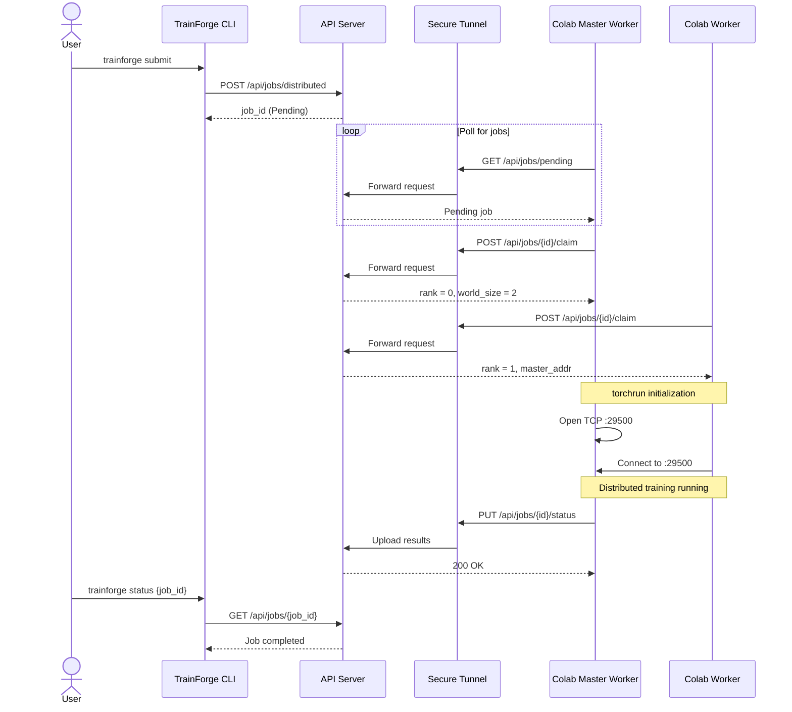

# TrainForge 🚀

**TrainForge** is a distributed AI training platform that allows you to run machine-learning workloads on **free external GPUs** (Google Colab, Kaggle) directly from your **local terminal**.

You define your job in a simple `trainforge.yaml`, run `trainforge submit`, and TrainForge:
- Packages your code
- Sends it securely via tunnel
- Orchestrates distributed GPU workers
- Runs training
- Retrieves results back locally

No expensive GPUs. No cloud VM management.

---

## 🏗️ Architecture Component Map



---

## 🔄 End-to-End Distributed Training Flow



---

## 💻 Python CLI Quickstart

### Installation

```bash
pip install -e .
```

Verify:

```bash
trainforge --help
```

---

### Initialize Project

```bash
trainforge init
```

Creates:
- `train.py`
- `trainforge.yaml`

---

### Example `trainforge.yaml`

```yaml
project:
  name: llama-finetune

training:
  script: train.py
  requirements: requirements.txt

resources:
  gpu: 1
  memory: 16Gi
```

---

### Submit Job

```bash
trainforge submit .
```

Distributed training:

```bash
trainforge submit . --workers 2
```

---

### Monitor & Retrieve Results

```bash
trainforge status <job_id>
trainforge pull <job_id>
```

---

## ☁️ Connecting External GPU Workers

```bash
pip install requests
python colab_worker.py
```

Ensure `API_URL` points to your public tunnel.
